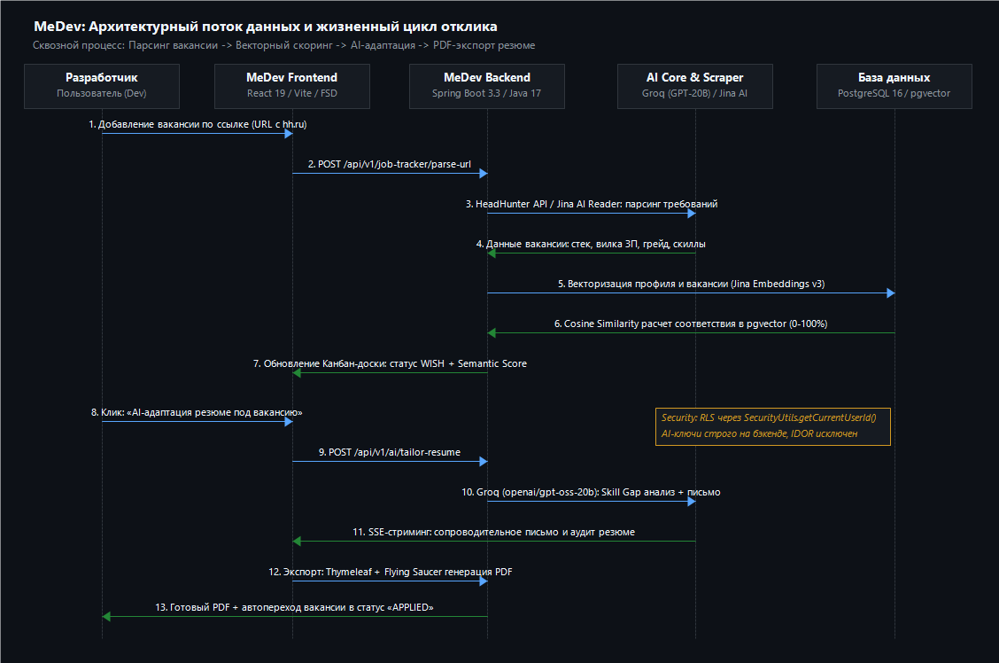

# Отчет по MeDev
**Дата:** 12.09.2026  
**Автор:** Мурат Орынбасар  

## MeDev – DevProfile & AI Job Assistant
Полноценная data-first SaaS-платформа для разработчиков: интерактивный профиль/портфолио, умный трекер вакансий с парсингом URL, AI-адаптация резюме под требования конкретной вакансии, RAG-семантический матчинг и экспорт в PDF. Готовая боевая база (Level 4), требующая финальных шагов перед выходом в релиз.

Таблица 1 описывает все модули, которые были реализованы в проекте/сайте.

### Таблица 1. Модули

| N | Модуль / Подсистема | Назначение и функциональность | Статус | Текущее состояние и задачи |
|---|---------------------|-------------------------------|--------|----------------------------|
| 1 | Лендинг (Визитка) | Публичный сайт, презентация возможностей, интерактивное демо резюме, тарифные планы, CTA | **Готово** | Базовая структура готова в строгом GitHub Dark Mode стиле. Высокая скорость загрузки, адаптивный UI. |
| 2 | Публичный профиль и портфолио (DevProfile) | Публичная страница разработчика (/p/:username), визитка, опыт, стек технологий, проекты, контакты | **Готово+** | Полностью функционирует. Строгая валидация полей, защищенный публичный доступ без раскрытия приватных данных. |
| 3 | Трекер вакансий (Job Tracker & Kanban) | Канбан-доска стадий (WISH, APPLIED, INTERVIEW, OFFER, REJECTED), заметки, вилка ЗП, дедлайны | **Готово+** | Высокая отзывчивость интерфейса (@dnd-kit), плавная фильтрация, пагинация, тесная интеграция с профилем и AI. |
| 4 | Умный парсинг вакансий (Smart Scraper) | Автоматический сбор деталей вакансий по URL: HeadHunter API (/vacancies/{id}), Jina AI Reader, Fallback | **Готово+** | Проверено на боевых ссылках hh.kz/hh.ru. Автоматически извлекает стек, зарплатную вилку, грейд и требования. |
| 5 | AI Карьерный Коуч и чат | Диалоговый ассистент на базе Groq API (openai/gpt-oss-20b), SSE-стриминг сообщений в реальном времени | **Готово+** | Стриминг ответов без задержек (<1 сек), контекстные системные промпты, подготовка к тех-интервью, аудит резюме. |
| 6 | AI-адаптация резюме под вакансию | Сопоставление профиля с вакансией (Skill Gap Analysis), генерация сопроводительного письма и точечных правок | **Готово+** | Автоматически выявляет пробелы в навыках и переписывает опыт под фокус требований конкретного работодателя. |
| 7 | RAG и семантический матчинг | Векторизация профиля и вакансий (Jina AI Embeddings v3), хранение в PostgreSQL pgvector, косинусный поиск | **Готово** | Репозиторий PgVectorRepository настроен, расчет индекса релевантности (0–100%) протестирован и оптимизирован. |
| 8 | Конструктор и PDF-экспорт резюме | Визуальный редактор блоков, генерация PDF (Thymeleaf + Flying Saucer + PDFBox), экспорт в JSON и TXT | **Готово** | Шаблоны сверстаны, экспорт функционирует. Требуется финальная проверка кириллических шрифтов на боевом сервере. |
| 9 | GitHub-интеграция и DevScore | Синхронизация публичных репозиториев, коммитов, языков через GitHub API, скоринг активности разработчика | **Готово** | Парсинг GitHub API работает стабильно, агрегация статистики и расчет рейтинга активности полностью настроены. |
| 10 | Безопасность, Auth и RBAC | JWT access (24ч), refresh tokens в Redis (30д), GitHub OAuth 2.0, Row-Level Security, IDOR-защита | **Готово+** | Пройден 5-осевой аудит безопасности. Уязвимости закрыты, RLS через SecurityUtils.getCurrentUserId() на всех эндпоинтах. |
| 11 | База данных и миграции | PostgreSQL 16 + pgvector, Redis Cache, строгое версионирование схемы через Flyway (миграции V1–V24) | **Готово+** | Строгие лимиты длины полей (varchar), каскадное удаление, внешние ключи, оптимизированные индексы. |
| 12 | VPS, инфраструктура и CI/CD | Контейнеризация Docker Compose, конфигурация под Render / Fly.io / VPS, Vercel / GitHub Pages | **В процессе** | Локально и в Docker работает без сбоев. Требуется развертывание на постоянном боевом VPS с выделенным доменом. |
| 13 | Биллинг и монетизация | Тарификация AI-токенов, премиум-шаблоны PDF-резюме, прием платежей через Kaspi Pay / Stripe | **В планах** | Архитектура лимитов спроектирована. Требуется боевое подключение эквайринга (Kaspi QR / Stripe Checkout). |
| 14 | Перспективы развития | Акселерация Astana Hub, Telegram-бот для уведомлений о статусах откликов, мобильная PWA-версия | **В планах** | Стратегические задачи второго этапа масштабирования проекта после набора первых 100 активных пользователей. |

### Состояние системы
Проект находится на стадии Production Live / Private Beta (Level 4). Развернут в Docker, функционирует быстро и стабильно.  
Все ключевые сущности работают без сбоев, дизайн строгий и эргономичный (GitHub Dark Mode), трекер вакансий и AI-модули работают плавно.  
Пройден полный 5-осевой технический аудит: закрыты риски IDOR, настроен Row-Level Security, защищены секреты и API-ключи, код соответствует стандартам SRP и FSD.  
Все пользовательские сценарии проверены вручную: парсинг реальных вакансий HeadHunter, адаптация резюме, векторный скоринг и экспорт в PDF.  

### Нужные улучшения и поправки:
1. Деньги и монетизация. Надо с вашей помощью обсудить модель тарификации: freemium с лимитом генераций (например, 3 бесплатные AI-адаптации в день) или помесячная подписка. Для Казахстана необходим Kaspi Pay (QR и выставление счета), для зарубежных пользователей — Stripe.
2. Боевой VPS, домен и Cloudflare. Серверная часть готова к непрерывной работе. Требуется перенос с временных бесплатных стендов на постоянный VPS, привязка собственного домена (например, medev.kz / medev.dev) и настройка защиты через Cloudflare (SSL, CDN, защита от DDoS).
3. AI API и отказоустойчивость. Модель Groq openai/gpt-oss-20b обеспечивает высочайшую скорость генерации (<1 сек). Необходимо настроить мониторинг расхода квот токенов и резервный пул API-ключей на случай пиковых нагрузок.
4. Парсинг вакансий и расширение каналов. Текущая связка HeadHunter API + Jina AI Reader работает стабильно. В планах добавить прямое извлечение вакансий из Habr Career, LinkedIn и профильных Telegram-каналов.
5. PDF-генерация резюме на сервере. Серверный движок Flying Saucer генерирует качественные документы, но на боевом Linux-сервере важно проконтролировать установку пакетов шрифтов (dejavu-sans / liberation), чтобы исключить артефакты кириллицы.
6. Бета-тестирование и первые пользователи. Запустить закрытое тестирование среди первых 20–50 практикующих разработчиков для сбора обратной связи по качеству AI-адаптации и юзабилити трекера вакансий.
7. Astana Hub. Подготовить проект к подаче заявки в Astana Hub для получения статуса участника IT-технопарка (налоговые льготы 0% КПН/ИПН, менторская поддержка, гранты).
8. Telegram-бот и мобильная версия. Разработку нативного мобильного приложения отложить на второй этап. В качестве оперативного решения использовать адаптивный PWA и легковесный Telegram-бот для мгновенных уведомлений об откликах и дедлайнах собеседований.

---

### Рисунок 1. Архитектурный поток данных MeDev: от парсинга вакансии до генерации резюме

